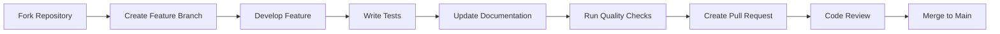

# Contributing Guide 🤝

Thank you for your interest in contributing to the OSRS Flip Dashboard! This
guide will help you get started with contributing to this project.

## 📋 Table of Contents

- [Code of Conduct](#code-of-conduct)
- [Getting Started](#getting-started)
- [Development Process](#development-process)
- [Pull Request Process](#pull-request-process)
- [Coding Standards](#coding-standards)
- [Testing Guidelines](#testing-guidelines)
- [Documentation](#documentation)

## 📜 Code of Conduct

### Our Pledge

We are committed to providing a friendly, safe, and welcoming environment for
all contributors, regardless of level of experience, gender identity and
expression, sexual orientation, disability, personal appearance, body size,
race, ethnicity, age, religion, or nationality.

### Our Standards

**Positive behaviors include:**

- Using welcoming and inclusive language
- Being respectful of differing viewpoints and experiences
- Gracefully accepting constructive criticism
- Focusing on what is best for the community
- Showing empathy towards other community members

**Unacceptable behaviors include:**

- The use of sexualized language or imagery
- Trolling, insulting/derogatory comments, and personal attacks
- Public or private harassment
- Publishing others' private information without permission
- Other conduct which could reasonably be considered inappropriate

### Enforcement

Project maintainers are responsible for clarifying the standards of acceptable
behavior and are expected to take appropriate and fair corrective action in
response to any instances of unacceptable behavior.

## 🚀 Getting Started

### Prerequisites

Before you begin, ensure you have:

```bash
# Required tools
Node.js >= 18.17.0 (LTS recommended)
npm >= 9.0.0 or yarn >= 1.22.0
Git >= 2.25.0

# Recommended tools
VS Code (with recommended extensions)
Chrome/Firefox DevTools
React DevTools browser extension
```

### Fork and Clone

```bash
# 1. Fork the repository on GitHub
# Click the "Fork" button on the main repository page

# 2. Clone your fork
git clone https://github.com/YOUR-USERNAME/OSRS-Flip-Tracker-Combined.git
cd OSRS-Flip-Tracker-Combined

# 3. Add upstream remote
git remote add upstream https://github.com/1000tomax/OSRS-Flip-Tracker-Combined.git

# 4. Install dependencies
npm install

# 5. Start development server
npm run dev
```

### Development Setup

```bash
# Install recommended VS Code extensions
code --install-extension esbenp.prettier-vscode
code --install-extension dbaeumer.vscode-eslint
code --install-extension bradlc.vscode-tailwindcss

# Copy environment template
cp .env.example .env.local

# Verify everything works
npm run lint        # Should pass
npm test           # Should run test suite
npm run typecheck  # Should pass TypeScript checks
npm run build      # Should create production build
```

## 🔄 Development Process

### Workflow Overview



### Creating a Feature Branch

```bash
# 1. Ensure main branch is up to date
git checkout main
git pull upstream main

# 2. Create feature branch
git checkout -b feature/your-feature-name

# Branch naming conventions:
# feature/add-new-chart          # New features
# bugfix/fix-table-sorting       # Bug fixes
# docs/update-readme             # Documentation updates
# refactor/improve-caching       # Code refactoring
# test/add-component-tests       # Testing improvements
```

### Development Cycle

```bash
# 1. Make your changes
# - Follow coding standards
# - Write/update tests
# - Update documentation

# 2. Run quality checks frequently
npm run lint:fix      # Fix linting issues
npm run format        # Format code
npm test             # Run test suite
npm run typecheck    # Check TypeScript

# 3. Commit your changes
git add .
git commit -m "feat: add new trading chart component"

# 4. Keep your branch updated
git fetch upstream
git rebase upstream/main

# 5. Push to your fork
git push origin feature/your-feature-name
```

### Commit Message Convention

We follow [Conventional Commits](https://www.conventionalcommits.org/)
specification:

```bash
# Format: <type>[optional scope]: <description>

# Types:
feat:     # New feature
fix:      # Bug fix
docs:     # Documentation only changes
style:    # Changes that don't affect meaning (formatting, etc.)
refactor: # Code change that neither fixes a bug nor adds a feature
test:     # Adding missing tests
chore:    # Changes to build process or auxiliary tools

# Examples:
git commit -m "feat: add strategy comparison component"
git commit -m "fix: resolve table sorting issue with numeric data"
git commit -m "docs: update API documentation for useApiData hook"
git commit -m "test: add unit tests for cache manager"
git commit -m "refactor: extract layout components for reusability"
```

## 🔍 Pull Request Process

### Before Creating a Pull Request

```bash
# 1. Ensure all quality checks pass
npm run lint          # No linting errors
npm test             # All tests pass
npm run typecheck    # No TypeScript errors
npm run build        # Builds successfully

# 2. Update your branch
git fetch upstream
git rebase upstream/main
git push origin feature/your-feature-name --force-with-lease

# 3. Test your changes thoroughly
npm run build:analyze  # Check bundle size impact
npm run test:coverage  # Ensure test coverage
```

### Pull Request Template

When creating a pull request, use this template:

```markdown
## Description

Brief description of what this PR does.

## Type of Change

- [ ] Bug fix (non-breaking change which fixes an issue)
- [ ] New feature (non-breaking change which adds functionality)
- [ ] Breaking change (fix or feature that would cause existing functionality to
      not work as expected)
- [ ] Documentation update

## Changes Made

- List the main changes
- Include any new components or utilities
- Mention any breaking changes

## Testing

- [ ] Unit tests added/updated
- [ ] Integration tests added/updated
- [ ] Manual testing completed
- [ ] Test coverage maintained/improved

## Screenshots (if applicable)

Before/after screenshots for UI changes.

## Checklist

- [ ] Code follows project style guidelines
- [ ] Self-review completed
- [ ] Tests added for new functionality
- [ ] Documentation updated
- [ ] No breaking changes (or clearly documented)
- [ ] Bundle size impact considered
```

### Review Process

1. **Automated Checks**: All CI checks must pass
2. **Code Review**: At least one maintainer review required
3. **Testing**: Reviewers may test functionality locally
4. **Documentation**: Ensure documentation is updated
5. **Performance**: Bundle size and performance impact reviewed

## 🎯 Coding Standards

### TypeScript Guidelines

```typescript
// 1. Use interfaces for object shapes
interface FlipData {
  itemName: string;
  profit: number;
  timestamp: Date;
}

// 2. Use type aliases for unions and computed types
type Status = 'pending' | 'completed' | 'failed';
type ViewMode = 'table' | 'cards';

// 3. Use generic constraints appropriately
function processData<T extends FlipData>(data: T[]): ProcessedData<T> {
  return data.map(item => ({ ...item, processed: true }));
}

// 4. Avoid 'any', prefer 'unknown' for uncertain types
function parseApiResponse(response: unknown): FlipData {
  // Use type guards for validation
  if (isFlipData(response)) {
    return response;
  }
  throw new Error('Invalid response format');
}

// 5. Use proper return types
function calculateProfit(spent: number, received: number): number {
  return received - spent;
}
```

### React Component Guidelines

```typescript
// 1. Use functional components with hooks
interface Props {
  data: FlipData[];
  onItemClick: (item: FlipData) => void;
}

function FlipTable({ data, onItemClick }: Props) {
  const [sortField, setSortField] = useState<keyof FlipData>('profit');

  // 2. Extract custom hooks for complex logic
  const sortedData = useSortedData(data, sortField);

  // 3. Use memo for expensive computations
  const totalProfit = useMemo(() => {
    return data.reduce((sum, flip) => sum + flip.profit, 0);
  }, [data]);

  // 4. Use callback for event handlers
  const handleRowClick = useCallback((flip: FlipData) => {
    onItemClick(flip);
  }, [onItemClick]);

  return (
    <table>
      {sortedData.map(flip => (
        <tr key={flip.id} onClick={() => handleRowClick(flip)}>
          <td>{flip.itemName}</td>
          <td>{flip.profit}</td>
        </tr>
      ))}
    </table>
  );
}
```

### File Organization

```bash
# Component files
components/
├── ComponentName.tsx          # Main component
├── ComponentName.test.tsx     # Component tests
├── ComponentName.stories.tsx  # Storybook stories (if applicable)
└── index.ts                  # Barrel export

# Hook files
hooks/
├── useHookName.ts            # Hook implementation
├── useHookName.test.ts       # Hook tests
└── index.ts                  # Barrel export

# Utility files
utils/
├── utilityName.ts            # Utility implementation
├── utilityName.test.ts       # Utility tests
└── index.ts                  # Barrel export
```

### Styling Guidelines

```typescript
// 1. Use Tailwind CSS utility classes
<div className="bg-gray-900 border border-gray-700 rounded-lg p-4">
  <h2 className="text-xl font-bold text-white mb-2">Title</h2>
  <p className="text-gray-300">Content</p>
</div>

// 2. Use consistent spacing scale
const spacing = {
  xs: 'p-1',      // 4px
  sm: 'p-2',      // 8px
  md: 'p-4',      // 16px
  lg: 'p-6',      // 24px
  xl: 'p-8',      // 32px
};

// 3. Use semantic color names
const colors = {
  profit: 'text-green-400',
  loss: 'text-red-400',
  neutral: 'text-gray-300',
  highlight: 'text-blue-400',
};

// 4. Responsive design patterns
<div className="grid grid-cols-1 md:grid-cols-2 lg:grid-cols-3 gap-4">
  {items.map(item => <ItemCard key={item.id} item={item} />)}
</div>
```

## 🧪 Testing Guidelines

### Testing Philosophy

- **Test Behavior, Not Implementation** - Focus on what users see and do
- **Avoid Testing Details** - Don't test internal component state
- **Use Proper Queries** - Prefer `getByRole`, `getByText` over `getByTestId`
- **Mock External Dependencies** - Keep tests isolated and fast

### Component Testing

```typescript
// Good component test
import { render, screen, fireEvent, waitFor } from '@testing-library/react';
import { QueryClient, QueryClientProvider } from '@tanstack/react-query';
import FlipTable from '../FlipTable';
import { mockFlipData } from '../../tests/utils/mockData';

describe('FlipTable', () => {
  let queryClient: QueryClient;

  beforeEach(() => {
    queryClient = new QueryClient({
      defaultOptions: { queries: { retry: false } }
    });
  });

  const renderWithProviders = (component: React.ReactElement) => {
    return render(
      <QueryClientProvider client={queryClient}>
        {component}
      </QueryClientProvider>
    );
  };

  it('should display flip data correctly', () => {
    renderWithProviders(<FlipTable data={mockFlipData} />);

    expect(screen.getByText('Abyssal whip')).toBeInTheDocument();
    expect(screen.getByText('250,000 GP')).toBeInTheDocument();
  });

  it('should handle item click events', async () => {
    const handleClick = jest.fn();
    renderWithProviders(
      <FlipTable data={mockFlipData} onItemClick={handleClick} />
    );

    fireEvent.click(screen.getByText('Abyssal whip'));

    await waitFor(() => {
      expect(handleClick).toHaveBeenCalledWith(mockFlipData[0]);
    });
  });
});
```

### Hook Testing

```typescript
// Good hook test
import { renderHook, act } from '@testing-library/react';
import { QueryClient, QueryClientProvider } from '@tanstack/react-query';
import { useApiData } from '../useApiData';
import { mockFetchSuccess } from '../../tests/utils/testUtils';

describe('useApiData', () => {
  let queryClient: QueryClient;

  beforeEach(() => {
    queryClient = new QueryClient({
      defaultOptions: { queries: { retry: false } }
    });
  });

  const wrapper = ({ children }: { children: React.ReactNode }) => (
    <QueryClientProvider client={queryClient}>
      {children}
    </QueryClientProvider>
  );

  it('should fetch and return data', async () => {
    const mockData = { message: 'Hello World' };
    mockFetchSuccess(mockData);

    const { result } = renderHook(() => useApiData('/api/test'), { wrapper });

    expect(result.current.loading).toBe(true);

    await waitFor(() => {
      expect(result.current.loading).toBe(false);
    });

    expect(result.current.data).toEqual(mockData);
    expect(result.current.error).toBeNull();
  });
});
```

### Test Coverage Requirements

- **Minimum Coverage**: 80% for new code
- **Critical Components**: 95% coverage required
- **Utilities**: 90% coverage required
- **Integration Points**: 85% coverage required

## 📚 Documentation

### Code Documentation

````typescript
/**
 * Processes trading data and calculates profit metrics
 *
 * @param flips - Array of trading flip data
 * @param options - Configuration options for processing
 * @returns Processed data with calculated metrics
 *
 * @example
 * ```typescript
 * const processed = processFlipData(rawFlips, {
 *   includeUnprofitable: false,
 *   sortBy: 'profit'
 * });
 * ```
 */
function processFlipData(
  flips: FlipData[],
  options: ProcessingOptions = {}
): ProcessedFlipData[] {
  // Implementation
}
````

### Component Documentation

````typescript
/**
 * Trading table component with sorting and filtering capabilities
 *
 * @component
 * @example
 * ```tsx
 * <FlipTable
 *   data={flips}
 *   onItemClick={(item) => console.log(item)}
 *   sortable={true}
 * />
 * ```
 */
interface FlipTableProps {
  /** Array of flip data to display */
  data: FlipData[];
  /** Callback fired when a row is clicked */
  onItemClick?: (item: FlipData) => void;
  /** Whether the table columns are sortable */
  sortable?: boolean;
}

function FlipTable({ data, onItemClick, sortable = true }: FlipTableProps) {
  // Implementation
}
````

### README Updates

When adding new features, update the README.md:

````markdown
# Add new feature to features list

- **New Feature Name** - Brief description of what it does

# Add usage example if needed

### Using the New Feature

```typescript
// Example code
```
````

# Update table of contents if needed

````

## 🚨 Common Issues and Solutions

### Build Issues

```bash
# Issue: TypeScript errors
npm run typecheck
# Fix all TypeScript errors before committing

# Issue: Linting errors
npm run lint:fix
# Fix remaining errors manually

# Issue: Test failures
npm test
# Fix failing tests before submitting PR

# Issue: Bundle size increase
npm run build:analyze
# Investigate and optimize large bundles
````

### Development Issues

```bash
# Issue: Hot reload not working
# Solution: Check if changes are in ignored directories
# Restart dev server: npm run dev

# Issue: Cache not clearing
# Solution: Clear all caches
rm -rf node_modules/.cache
rm -rf dist
npm run dev

# Issue: TypeScript not recognizing new types
# Solution: Restart TypeScript server in VS Code
# Cmd/Ctrl + Shift + P > "TypeScript: Restart TS Server"
```

## 🎯 Contribution Areas

We welcome contributions in these areas:

### High Priority

- **Bug Fixes** - Fix existing issues and improve reliability
- **Performance** - Optimize bundle size and runtime performance
- **Accessibility** - Improve screen reader support and keyboard navigation
- **Testing** - Increase test coverage and add integration tests

### Medium Priority

- **Features** - Add new trading analysis features
- **Documentation** - Improve guides and API documentation
- **TypeScript** - Complete TypeScript migration
- **UI/UX** - Enhance user interface and experience

### Low Priority

- **Refactoring** - Code quality improvements
- **Tooling** - Development experience enhancements
- **Examples** - Add more usage examples
- **Optimization** - Minor performance improvements

## 📞 Getting Help

### Communication Channels

- **GitHub Issues** - Bug reports and feature requests
- **GitHub Discussions** - Questions and general discussion
- **Discord** - Real-time chat with community (if available)

### Questions?

- Check existing
  [GitHub Issues](https://github.com/1000tomax/OSRS-Flip-Tracker-Combined/issues)
- Search
  [GitHub Discussions](https://github.com/1000tomax/OSRS-Flip-Tracker-Combined/discussions)
- Create a new issue with the "question" label

### Mentorship

New contributors are welcome! Maintainers are happy to:

- Review your first PR with detailed feedback
- Help you find good first issues to work on
- Provide guidance on project architecture
- Answer questions about development setup

---

Thank you for contributing to the OSRS Flip Dashboard! Your contributions help
make this tool better for the entire OSRS trading community. 🚀
