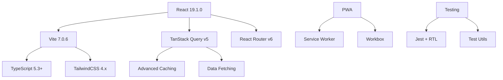
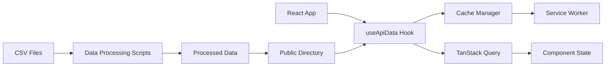
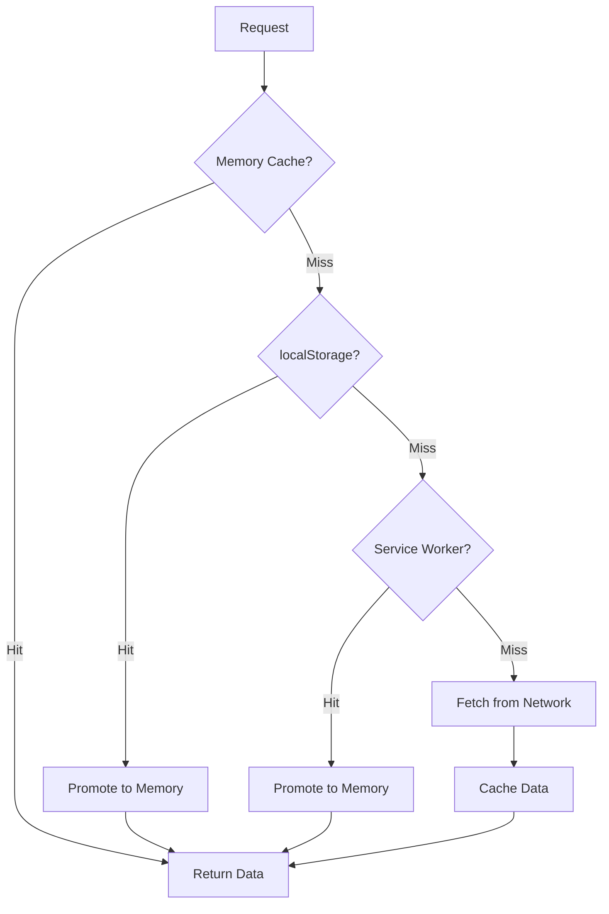

# Architecture Guide 🏗️

This document provides a comprehensive overview of the OSRS Flip Dashboard architecture, design patterns, and technical decisions.

## 📋 Table of Contents

- [System Overview](#system-overview)
- [Architecture Patterns](#architecture-patterns)
- [Data Flow](#data-flow)
- [Component Architecture](#component-architecture)
- [State Management](#state-management)
- [Caching Strategy](#caching-strategy)
- [Performance Optimizations](#performance-optimizations)
- [Security Considerations](#security-considerations)

## 🎯 System Overview

The OSRS Flip Dashboard is a **client-side React application** built with modern web technologies, designed for high performance and excellent user experience.

### Core Principles

1. **Performance First** - Aggressive caching and optimization
2. **Scalable Architecture** - Modular, maintainable code structure
3. **Type Safety** - Gradual TypeScript adoption
4. **User Experience** - Responsive, accessible, PWA-ready
5. **Developer Experience** - Modern tooling and best practices

### Technology Stack



## 🏛️ Architecture Patterns

### 1. Layered Architecture

The application follows a **layered architecture** pattern:

```
┌─────────────────────────────────────┐
│             Presentation            │  ← Pages, Components, UI
├─────────────────────────────────────┤
│               Business              │  ← Hooks, State Management
├─────────────────────────────────────┤
│               Service               │  ← API Layer, Data Fetching
├─────────────────────────────────────┤
│              Infrastructure         │  ← Caching, Utils, Types
└─────────────────────────────────────┘
```

### 2. Component-Based Architecture

```typescript
// High-level component hierarchy
App
├── Router
│   ├── Navigation
│   ├── SEO
│   └── Pages
│       ├── Home
│       ├── Items  
│       ├── FlipLogs
│       ├── Charts
│       └── Performance
├── Layouts
│   ├── PageContainer
│   ├── CardContainer
│   └── ResponsiveGrid
└── Utils
    ├── ErrorBoundary
    ├── CacheMonitor
    └── LoadingSpinner
```

### 3. Hook-Based Logic

Business logic is encapsulated in **custom hooks**:

```typescript
// Data fetching hooks
useApiData()     // Generic data fetching with caching
useCsvData()     // CSV file processing
useJsonData()    // JSON data loading

// Business logic hooks
useAllFlips()    // Load all trading data
useStrategyAnalysis() // Trading strategy analysis
useDailySummaries()   // Daily summary calculations
```

## 🔄 Data Flow

### Data Architecture



### File Structure

```
public/data/
├── processed-flips/
│   └── YYYY/MM/DD/
│       └── flips.csv          # Daily trading data
├── item-stats.csv             # Aggregated statistics
├── summary-index.json         # Data index
└── item-embeddings.json       # ML similarity vectors
```

### Data Processing Pipeline

1. **Raw Data Import** - Flipping Copilot CSV exports
2. **Processing Scripts** - Node.js data transformation
3. **Static Generation** - Pre-processed files for web serving
4. **Runtime Loading** - Optimized data fetching with caching

## 🧩 Component Architecture

### Layout Components

Reusable layout components provide consistent structure:

```typescript
// Layout system
<PageContainer padding="normal">
  <CardContainer>
    <PageHeader title="Page Title" icon="📊" />
    <ResponsiveGrid variant="twoColumn">
      <MainContent />
      <Sidebar />
    </ResponsiveGrid>
  </CardContainer>
</PageContainer>
```

### Page Components

Pages focus on **composition** rather than business logic:

```typescript
// Example page structure
export default function ItemsPage() {
  // Data fetching (delegated to hooks)
  const { data, loading, error } = useCsvData('/data/item-stats.csv');
  
  // Loading/error states (delegated to layouts)
  if (loading) return <LoadingLayout />;
  if (error) return <ErrorLayout error={error} />;
  
  // Main render (composition of components)
  return (
    <PageContainer>
      <CardContainer>
        <PageHeader title="Item Statistics" />
        <SearchControls />
        <SortableTable data={data} />
      </CardContainer>
    </PageContainer>
  );
}
```

### Specialized Components

Domain-specific components handle complex functionality:

- **Charts** - Recharts-based visualizations
- **Tables** - Sortable, searchable data tables  
- **Navigation** - Responsive navigation with active states
- **DatePickers** - Calendar navigation for time-series data

## 📊 State Management

### State Architecture

The application uses a **hybrid state management** approach:

```typescript
// Global State (React Query)
QueryClient {
  queries: {
    'api-data:/data/item-stats.csv': { data, meta },
    'flip-data:2025-01-15': { data, meta },
  },
  mutations: {},
  cache: Map<string, QueryData>
}

// Local State (React hooks)
useState()  // Component-level state
useReducer() // Complex local state logic

// URL State (React Router)
useLocation() // Current route and query params
useNavigate() // Programmatic navigation
```

### Data Flow Patterns

1. **Server State** → TanStack Query → Components
2. **Local State** → useState/useReducer → UI
3. **URL State** → React Router → Navigation
4. **Cache State** → Cache Manager → Performance

## 🚀 Caching Strategy

### Multi-Layer Caching



### Cache Instances

```typescript
// Specialized cache instances
flipDataCache     // Trading data (1 hour TTL)
summaryCache      // Summary data (30 min TTL)
chartCache        // Chart data (15 min TTL, memory only)
itemStatsCache    // Item statistics (2 hours TTL)
```

### Cache Warming

Intelligent **background preloading**:

1. **Critical Data** - Essential app data loaded immediately
2. **Recent Data** - Last 3 days of trading data
3. **Static Assets** - Fonts, icons, metadata
4. **Predictive** - Data likely to be accessed next

## ⚡ Performance Optimizations

### Bundle Optimization

```javascript
// Vite configuration for optimal bundling
export default defineConfig({
  build: {
    rollupOptions: {
      output: {
        manualChunks: {
          'react-vendor': ['react', 'react-dom', 'react-router'],
          'charts': ['recharts'],
          'tanstack': ['@tanstack/react-query'],
          'utils': ['papaparse', 'html2canvas'],
        }
      }
    }
  }
});
```

### Code Splitting

```typescript
// Lazy loading for route components
const Home = lazy(() => import('./pages/Home'));
const Items = lazy(() => import('./pages/Items'));
const Charts = lazy(() => import('./pages/Charts'));

// Suspense boundaries for loading states
<Suspense fallback={<LoadingLayout />}>
  <Routes>
    <Route path="/" element={<Home />} />
    <Route path="/items" element={<Items />} />
  </Routes>
</Suspense>
```

### Data Optimization

- **CSV Processing** - Client-side Papa Parse for flexibility
- **Data Chunking** - Large datasets split by date ranges
- **Compression** - Gzip compression for static assets
- **CDN Ready** - Optimized for global content delivery

## 🔒 Security Considerations

### Client-Side Security

1. **No Sensitive Data** - All data is public trading information
2. **XSS Prevention** - React's built-in XSS protection
3. **Content Security Policy** - Restrictive CSP headers
4. **HTTPS Only** - All production traffic encrypted

### Data Privacy

1. **No User Tracking** - Privacy-focused analytics only
2. **Local Storage** - All personal data stays on device
3. **No External APIs** - Self-contained application
4. **Transparent Logging** - All data flows documented

### Development Security

```typescript
// Security-focused linting rules
{
  rules: {
    'no-eval': 'error',
    'no-implied-eval': 'error', 
    'no-new-func': 'error',
    'no-script-url': 'error',
  }
}
```

## 🔧 Build System

### Vite Configuration

```javascript
// Production-optimized build configuration
export default defineConfig({
  build: {
    target: 'es2020',
    minify: 'terser',
    sourcemap: false,
    cssCodeSplit: true,
    chunkSizeWarningLimit: 500,
  },
  optimizeDeps: {
    include: ['react', 'react-dom', '@tanstack/react-query'],
    exclude: ['@vite/client', '@vite/env'],
  },
});
```

### Development Workflow

```bash
# Development pipeline
npm run dev          # Start with HMR
npm run lint         # Code quality checks  
npm run test         # Run test suite
npm run typecheck    # TypeScript validation
npm run build        # Production build
```

## 📈 Scalability Considerations

### Performance Scaling

- **Lazy Loading** - Route-based code splitting
- **Data Virtualization** - Large list performance
- **Background Processing** - Web Workers for heavy computation
- **Memory Management** - Automatic cache cleanup

### Code Scaling

- **Modular Architecture** - Easy to add new features
- **TypeScript Migration** - Gradual type safety adoption
- **Testing Strategy** - Comprehensive test coverage
- **Documentation** - Maintainable codebase

### Data Scaling

- **Pagination Support** - Handle large datasets
- **Infinite Queries** - Progressive data loading
- **Index Optimization** - Fast data lookup
- **Compression** - Efficient data storage

## 🔄 Migration Paths

### TypeScript Migration

```typescript
// Current: Mixed JS/TS codebase
src/
├── components/     # 70% TypeScript
├── hooks/         # 90% TypeScript  
├── utils/         # 95% TypeScript
├── pages/         # 30% TypeScript
└── types/         # 100% TypeScript

// Target: Full TypeScript adoption
// Strategy: Gradual conversion with strict mode
```

### Testing Enhancement

```typescript
// Current coverage: ~60%
// Target coverage: >90%
// Strategy: Add tests for new features, retrofit existing
```

## 📝 Design Decisions

### Why React Query?

- **Declarative** - Simplifies data fetching logic
- **Caching** - Built-in intelligent caching
- **Background Updates** - Keeps data fresh automatically
- **Error Handling** - Comprehensive error boundaries

### Why Vite?

- **Performance** - Lightning fast development
- **Modern** - Native ES modules support
- **Simple** - Minimal configuration required
- **Ecosystem** - Excellent plugin ecosystem

### Why TailwindCSS?

- **Utility-First** - Rapid UI development
- **Consistent** - Design system enforcement
- **Performance** - Purged CSS for production
- **Responsive** - Mobile-first design patterns

---

This architecture provides a solid foundation for continued development while maintaining high performance and excellent developer experience. The modular design allows for easy feature additions and modifications without affecting existing functionality.